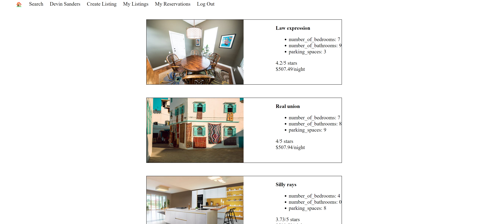

# LightBnB Web Application

LightBnB is a web application for managing short-term property rentals, similar to platforms like Airbnb. This project showcases the integration of front-end and back-end technologies, including the use of a PostgreSQL database, Express.js for the server, and various libraries for enhancing the functionality.

## Table of Contents

- [Screenshots](#screenshots)
- [Features](#features)
- [Technologies](#technologies)
- [Project Structure](#project-structure)
- [Installation](#installation)
- [Usage](#usage)
- [Contributing](#contributing)
- [License](#license)

## Screenshots
### Homepage

*Caption describing the screenshot*

### Property Listing

*Caption describing the screenshot*

## Features

- User authentication and session management
- Property listings with filtering options
- Reservation management
- Average length of reservations and most visited cities
- Responsive design

## Technologies

- Node.js
- Express.js
- PostgreSQL
- HTML/CSS
- JavaScript
- bcrypt for password hashing
- cookie-session for session management

## Project Structure

```
├── db
│   ├── database.js
│   ├── index.js
│   ├── json
│   │   ├── properties.json
│   │   └── users.json
│   └── queries
│       ├── properties.js
│       ├── reservations.js
│       └── users.js
├── public
│   ├── images
│   │   ├── homepage-screenshot.png
│   │   └── property-listing-screenshot.png
│   ├── index.html
│   ├── javascript
│   │   ├── components
│   │   │   ├── header.js
│   │   │   ├── login_form.js
│   │   │   ├── new_property_form.js
│   │   │   ├── property_listing.js
│   │   │   ├── property_listings.js
│   │   │   ├── search_form.js
│   │   │   └── signup_form.js
│   │   ├── index.js
│   │   ├── libraries
│   │   │   ├── addressfield
│   │   │   │   ├── addressfield.min.json
│   │   │   │   └── jquery.addressfield.min.js
│   │   │   ├── jquery-3.4.0.min.js
│   │   │   └── moment.js
│   │   ├── network.js
│   │   └── views_manager.js
│   └── styles
│       ├── main.css
│       ├── main.css.map
├── routes
│   ├── apiRoutes.js
│   └── userRoutes.js
├── styles
│   ├── _forms.scss
│   ├── _header.scss
│   ├── _property-listings.scss
│   └── main.scss
├── .gitignore
├── LICENSE
├── package-lock.json
├── package.json
├── README.md
└── server.js
```

* `db` contains all the database interaction code.
  * `index.js` is the main entry point for database connections and query methods.
  * `database.js` contains general database setup and configuration.
  * `json` is a directory that contains a bunch of dummy data in `.json` files.
    * `users.json` contains dummy data for users.
    * `properties.json` contains dummy data for properties.
  * `queries` is a directory that contains specific query functions for different entities.
    * `properties.js` contains queries related to property listings.
    * `reservations.js` contains queries related to reservations.
    * `users.js` contains queries related to user data.
* `public` contains all of the HTML, CSS, client-side JavaScript, and image assets.
  * `index.html` is the entry point to the application. It's the only HTML page because this is a single page application.
  * `styles` contains all of the CSS files.
    * `main.css` is the compiled CSS file.
    * `main.css.map` is the source map for the compiled CSS file.
  * `javascript` contains all of the client-side JavaScript files.
    * `index.js` starts up the application by rendering the listings.
    * `network.js` manages all AJAX requests to the server.
    * `views_manager.js` manages which components appear on screen.
    * `libraries` contains third-party JavaScript libraries.
      * `jquery-3.4.0.min.js` is the jQuery library.
      * `moment.js` is the Moment.js library.
      * `addressfield` contains the addressfield jQuery plugin.
        * `jquery.addressfield.min.js` is the main plugin file.
        * `addressfield.min.json` is the configuration for the plugin.
    * `components` contains all of the individual HTML components. They are all created using jQuery.
      * `property_listing.js` manages the property listing component.
      * `property_listings.js` manages the list of property listings.
      * `search_form.js` manages the search form component.
      * `signup_form.js` manages the signup form component.
      * `new_property_form.js` manages the new property form component.
      * `login_form.js` manages the login form component.
      * `header.js` manages the header component.
  * `images` contains all of the image assets, including screenshots for the README.
    * `homepage-screenshot.png` is a screenshot of the homepage.
    * `property-listing-screenshot.png` is a screenshot of a property listing.
* `routes` contains the router files which are responsible for any HTTP requests to `/users/something` or `/api/something`.
  * `apiRoutes.js` handles API requests related to properties and reservations.
  * `userRoutes.js` handles user authentication and user-related requests.
* `styles` contains all of the SASS files.
  * `_property-listings.scss` contains styles for the property listings.
  * `_forms.scss` contains styles for forms.
  * `_header.scss` contains styles for the header.
  * `main.scss` is the main SASS file that imports all other SASS files.
* `.gitignore` specifies files and directories that should be ignored by Git.
* `LICENSE` contains the license to use this software and associated documentation files.
* `package-lock.json` contains the locked versions of dependencies.
* `package.json` contains metadata about the project and its dependencies.
* `README.md` contains the manual for installing and using the software.
* `server.js` is the entry point to the application. This connects the routes to the database and sets up middleware.

## Installation

1. Clone the repository:
   ```
   git clone https://github.com/yourusername/LightBnB.git
   cd LightBnB
   ```

2. Install the dependencies:
   ```
   npm install
   ```

3. Set up the database:
   - Ensure PostgreSQL is installed and running.
   - Create a database and configure the connection details in the `db/index.js` file.

4. Run the migrations and seed the database (if applicable):
   ```
   psql -U yourusername -d lightbnb -f db/migrations/01_create_users.sql
   psql -U yourusername -d lightbnb -f db/migrations/02_create_properties.sql
   psql -U yourusername -d lightbnb -f db/seeds/seed.sql
   ```

## Usage

1. **Start the server**:
   - To start the server using `node`, run:
     ```
     npm start
     ```
   - Alternatively, to automatically restart the server when changes are made to your files, use:
     ```
     npm run local
     ```
     
2. Open your browser and navigate to `http://localhost:3000`.

## Contributing

1. Fork the repository.
2. Create a new branch (`git checkout -b feature-branch`).
3. Make your changes and commit them (`git commit -m 'Add some feature'`).
4. Push to the branch (`git push origin feature-branch`).
5. Create a new Pull Request.

## License

This project is licensed under the MIT License - see the [LICENSE](LICENSE) file for details.


